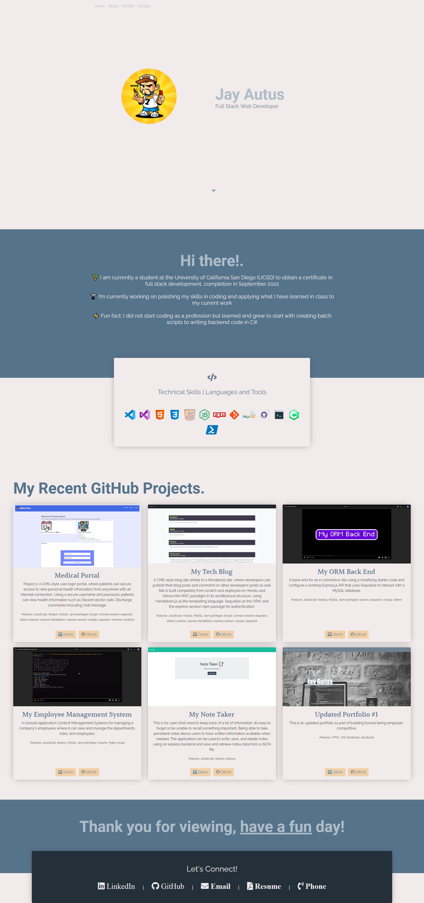

# Updated Portfolio Page #2 | jak3ster.github.io

This is an updated portfolio after building a full-stack web application and additional projects to share and other materials to build toward being employer-competitive.

## Description

* Updated portfolio featuring examples of both deployed projects of homeworks

* Update GitHub profile with pinned repositories featuring 3+ examples of student work from both deployed projects of homeworks

* Updated resume

* Updated LinkedIn profile

## Installation

1. Download or clone repository
2. Open the main page (index.html) on your browser to view webpage
3. On the main page, you can click on the links on top left to go to the location in the page for portfolio, about and contact

## Features

* Displaying full name with contact information including email and phone number
* Links to GitHub profile and LinkedIn profile
* A Link to a downloadable PDF of resume
* Project 1 and exemplary homework assignments including the following:
  * Screenshot of the deployed application
  * Title
  * Link to the deployed version
  * Link to the GitHub repository
* Polished, mobile-responsive user interface

## Technologies Used

* HTML
* CSS
* Bootstrap
* JavaScript

## Demo

## Website & Repository

* Github: <https://github.com/jak3ster/jak3ster.github.io/>
* Deployed: <https://jak3ster.github.io/>
